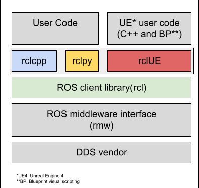

rclUE Design
============

Unreal Architecture
--------------------
One of the core features of Unreal Engine is the ability to
create new objects and expose properties and functions to
the editor by way of panel integration (i.e. for changing data properties)
or Blueprint, for scripting logic.

Unreal’s type system favors inheritance over composition,
and requires that (ultimately) all classes that work with
these features derive from a base UObject class. These UObjects are managed memory,
similar to Java objects, and Unreal has a built-in garbage collector to service them.

To further empower the system, data structures such as arrays, maps,
and many functionalities which exist inside the C++ STL have a custom implementation
to also support such serialization. While it is possible to use STL, the preference
in Unreal is to use the built-in equivalent functionality.

Previous works for UE4-ROS integration
--------------------------------------
`ROSIntegration <https://github.com/code-iai/ROSIntegration>`_ is a UE4’s plugin to enable communication between ROS1 and UE4 through rosbridge.
`CARLA <https://carla.org/>`_ , a simulator for autonomous driving research,
is based on a fork of UE4 and has its own ROS bridge
to enable communication between ROS (including ROS2) and itself.

`AirSim <https://microsoft.github.io/AirSim/>`_ is a simulation software designed for drones and wheeled vehicles,
and integrates with ROS through a wrapper composed of 2 nodes: one for the C++
multirotor client library and one for the PD position controller.

Both CARLA Sim and AirSim take advantage of Unreal Engine’s rendering
capabilities to perform machine learning tasks related to autonomous driving.

In contrast to the integrations done in AirSim and CARLA,
rclUE is designed to be simple and portable. For this, we implement
the required ROS2 functionalities in a UE plugin (similarly to ROSIntegration),
so that it can be easily included in different UE projects and is therefore more
accessible for the community.

Additionally, our tool integrates with UE’s architecture,
mapping ROS2 elements to UE types (e.g. Nodes as Actors, Publishers as ActorComponents)
and the editing of parameters from UE’s interface and extension through Blueprint visual
scripting language.

It is our hope that the rclUE plugin will also allow non-ROS developers to leverage ROS2
software in UE with minimal effort, thus inviting contributions from specialists outside
of robotics fields.

rclUE Architecture
------------------
Because of Unreal’s opinionated architecture, a clean implementation must follow the general
practices of the engine, and cannot itself bring design opinions.
Therefore it makes sense to choose a ROS2 client library written in C (rcl, rclc),
rather than C++ (rclcpp). In particular, rclcpp is built on fundamentals of
inheritance which can directly conflict with UE4’s version of inheritance necessary
to work with serialization and garbage collection.

The picture below shows how our rclUE layer fits in the overall architecture.

Hereafter we discuss some implementation details for ROS2 nodes, publishers and subscribers,
with other components (services, actions) following the same principles.

ROS2 Node
^^^^^^^^^
ROS2Node is implemented as UE Actor, the base class for objects that can be placed in a level
(i.e. the simulation world). The ROS2Node tracks and manages publishers, subscribers,
service clients and services (and thus contains a simplified equivalent of rclcpp’s executor).

ROS2 Publisher
^^^^^^^^^^^^^^
ROS2Pulisher is implemented as an ActorComponent, the base class for components that define
reusable behavior that can be added to different types of Actors. As an ActorComponent,
it can be attached to any actor that requires a publisher.

ROS2 Subscriber
^^^^^^^^^^^^^^^
Topic subscription is implemented as a method of ROS2Node and is bound to a callback method
through a UE delegate. An Actor that wants to subscribe to a topic therefore registers
its callback function to a ROS2Node.
