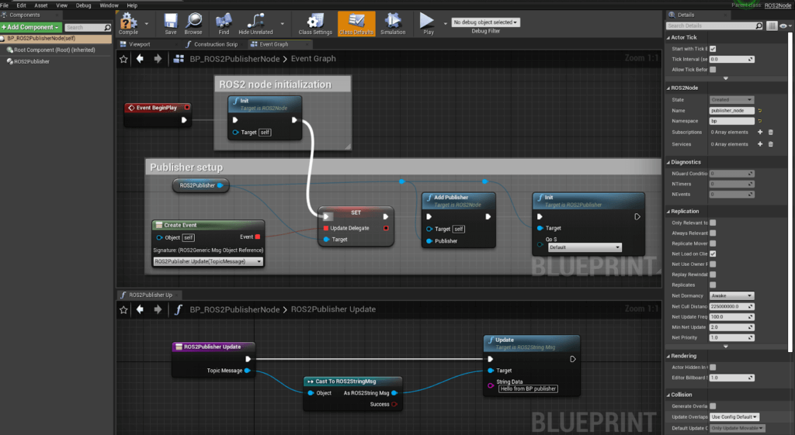
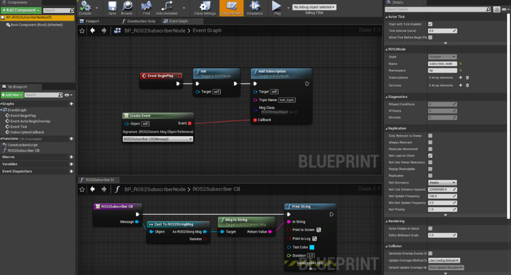

Examples
========
\* The content presented here can be found in the `ROS2Examples folder of the turtlebot3-UE sample code. <https://github.com/rapyuta-robotics/turtlebot3-UE/tree/devel/Source/turtlebot3/ROS2Examples>`_ .

Setup and run
---------------
1. Download UE5.1 for Linux by following `Unreal Engine for Linux <https://www.unrealengine.com/en-US/linux>`_.
2. Clone and build

.. code-block:: shell

    git clone `turtlebot3-UE <https://github.com/rapyuta-robotics/turtlebot3-UE/>`_
    cd turtlebot3-UE
    ./update_project_files.sh
    ./make_editor.sh

3. Run

.. code-block:: shell

    ./run_editor.sh

4. Open `turtlebot3-UE/Content/Maps/PubSub.umap` and Play.

PubSub Example (Unreal C++)
---------------------------

.. raw:: html

    <iframe width="560" height="315" src="https://www.youtube.com/embed/p9MZOv3uLJw" title="YouTube video player" frameborder="0" allow="accelerometer; autoplay; clipboard-write; encrypted-media; gyroscope; picture-in-picture" allowfullscreen></iframe>

.. raw:: html

    

On a ROS2Node Actor, after initializing it, we initialize
the ActorComponent StringPublisher with NewObject,
 will initialize publisher and add publisher to node(this).

Subsequently we call InitializeWithROS2(this) which will add the publisher to node and initialize it.

Note that we set up the publisher in BeginPlay,
a method for Actors that gets called when we start the simulation,
instead of doing it in the constructor, which only gets called when
the actor is added to the scene or when the executable is compiled.

An important distinction is that by initializing things in BeginPlay,
variables (such as publication frequency) can be set in the editor
and their change will be reflected when running the simulation.
If, in contrast, we initialize things in the constructor,
variables changed in the editor would not reflect in the simulation,
unless we restart the editor.

.. raw:: html

    

To add a subscription, after the node is initialized,
we bind a callback function to the object of type
FSubscriptionCallback and call AddSubscription.

In this example, we used a publisher and a subscriber node
to keep it simple, but in practical use cases,
the elements presented should be integrated
in the actors that need these functionalities.

PubSub Example (Blueprint)
--------------------------

.. raw:: html

   <iframe width="560" height="315" src="https://www.youtube.com/embed/n40sYyrkAt0" title="YouTube video player" frameborder="0" allow="accelerometer; autoplay; clipboard-write; encrypted-media; gyroscope; picture-in-picture" allowfullscreen></iframe>

Setup of a ROS2 Node with a string publisher: initialize
the Actor ROS2Node actor, then add the ActorComponent
Publisher and initialize it on the node that will publish the message.
The node and publisher parameters (node name, message type,
topic name and publication frequency) are set in the Details panel
(note that the red line connects to the callback function shown at the bottom).

Setup of a ROS2 Node with a string subscriber: initialize the Actor ROS2Node actor,
then add the subscription and bind callback function which
prints the logs on the window (note that the red line connects
to the callback function shown at the bottom).

Note that this is only one of the many ways in which a pubsub can be set up.
