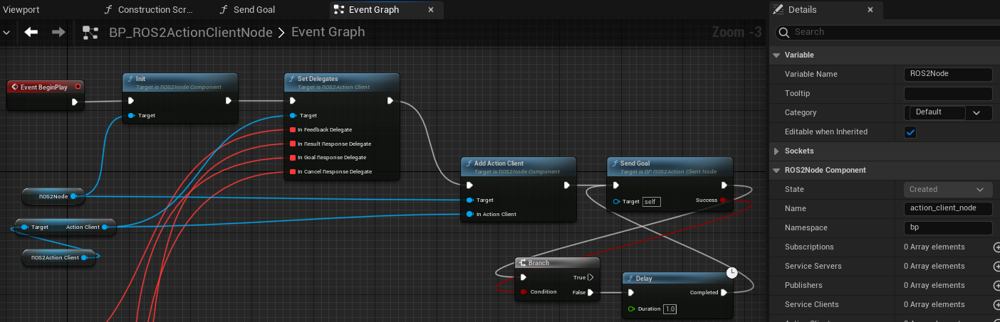

=============================
Action Client Example
=============================

Please follow the instructions in  :ref:`setup_and_run_ue_project` to setup the UE project 
and open  `ROS2ActionExample.umap <https://github.com/rapyuta-robotics/turtlebot3-UE/blob/devel/Content/Maps/ROS2TopicExamples.umap>`_.

-----------------------------
C++ Action Client
-----------------------------

This example send next action goal when received action result.

^^^^^^^^^^^^^^^^^^
Code
^^^^^^^^^^^^^^^^^^

.. code-block:: C++

    //ROS2ActionClientNode.h

    UCLASS()
    class TURTLEBOT3_API AROS2ActionClientNode : public AActor
    {
        GENERATED_BODY()

    public:
        AROS2ActionClientNode();

        virtual void BeginPlay() override;

        UPROPERTY(EditAnywhere, BlueprintReadWrite)
        UROS2NodeComponent* Node = nullptr;

        UPROPERTY(EditAnywhere, BlueprintReadWrite)
        UROS2ActionClient* FibonacciActionClient = nullptr;

        UPROPERTY(EditAnywhere, BlueprintReadWrite)
        FString ActionName = TEXT("fibonacci_action");

        UPROPERTY(EditAnywhere, BlueprintReadWrite)
        int Order = 3;

        UPROPERTY()
        FTimerHandle ActionTimerHandle;

        UFUNCTION()
        void FeedbackCallback(UROS2GenericAction* InAction);
        UFUNCTION()
        void ResultCallback(UROS2GenericAction* InAction);
        UFUNCTION()
        void GoalResponseCallback(UROS2GenericAction* InAction);
        UFUNCTION()
        void CancelCallback();

        UFUNCTION()
        void SendGoal();

    private:
        FROSFibonacciFB FeedbackMsg;
        FROSFibonacciSGReq GoalRequest;
    };

.. code-block:: C++

    //AROS2ActionClientNode.cpp

   AROS2ActionClientNode::AROS2ActionClientNode()
    {
        Node = CreateDefaultSubobject<UROS2NodeComponent>(TEXT("ROS2NodeComponent"));

        // these parameters can be change from BP
        Node->Name = TEXT("action_client_node");
        Node->Namespace = TEXT("cpp");
    }

    void AROS2ActionClientNode::BeginPlay()
    {
        Super::BeginPlay();
        Node->Init();

        ROS2_CREATE_ACTION_CLIENT(Node,
                                this,
                                ActionName,
                                UROS2FibonacciAction::StaticClass(),
                                &AROS2ActionClientNode::GoalResponseCallback,
                                &AROS2ActionClientNode::ResultCallback,
                                &AROS2ActionClientNode::FeedbackCallback,
                                &AROS2ActionClientNode::CancelCallback,
                                FibonacciActionClient);

        SendGoal();
    }

    void AROS2ActionClientNode::SendGoal()
    {
        // Create goal
        UROS2FibonacciAction* FibonacciAction = Cast<UROS2FibonacciAction>(FibonacciActionClient->Action);
        FROSFibonacciSGReq goalRequest;
        goalRequest.Order = Order;
        FibonacciAction->SetGoalRequest(goalRequest);

        // send goal
        if (!FibonacciActionClient->SendGoal())
        {
            // if it failes, retry after 1s
            UE_LOG_WITH_INFO_NAMED(
                LogTurtlebot3, Warning, TEXT("[%s][C++][send goal] failed to sendo goal. retry in 1s..."), *ActionName);
            GetWorld()->GetTimerManager().SetTimer(ActionTimerHandle, this, &AROS2ActionClientNode::SendGoal, 1.f, false);
        }
        else
        {
            UE_LOG_WITH_INFO_NAMED(LogTurtlebot3, Log, TEXT("[%s][C++][send goal] order: %i"), *ActionName, Order);
        }
    }

    void AROS2ActionClientNode::FeedbackCallback(UROS2GenericAction* InAction)
    {
        UROS2FibonacciAction* FibonacciAction = Cast<UROS2FibonacciAction>(InAction);
        FROSFibonacciFB feedback;
        FibonacciAction->GetFeedback(feedback);

        UE_LOG_WITH_INFO_NAMED(LogTurtlebot3,
                            Log,
                            TEXT("[%s][C++][received feedback callback] last element of feedback sequence: %d"),
                            *ActionName,
                            feedback.Sequence.Last(0));
    }

    void AROS2ActionClientNode::ResultCallback(UROS2GenericAction* InAction)
    {
        UROS2FibonacciAction* FibonacciAction = Cast<UROS2FibonacciAction>(InAction);
        FROSFibonacciGRRes resultResponse;
        FibonacciAction->GetResultResponse(resultResponse);

        // Log request and response
        FString resultString;
        for (int s : resultResponse.Sequence)
        {
            resultString += FString::FromInt(s) + ", ";
        }
        UE_LOG_WITH_INFO_NAMED(
            LogTurtlebot3, Log, TEXT("[%s][C++][received result callback] result is: %s"), *ActionName, *resultString);

        // update order and send next goal
        Order++;
        SendGoal();
    }

    void AROS2ActionClientNode::GoalResponseCallback(UROS2GenericAction* InAction)
    {
        UROS2FibonacciAction* FibonacciAction = Cast<UROS2FibonacciAction>(InAction);
        FROSFibonacciSGRes goalResponse;
        FibonacciAction->GetGoalResponse(goalResponse);

        if (!goalResponse.bAccepted)
        {
            UE_LOG_WITH_INFO_NAMED(LogTurtlebot3,
                                Warning,
                                TEXT("[%s][C++][receive goal response callback] goal request is rejected. retry in 1s..."),
                                *ActionName);
        }
        else
        {
            UE_LOG_WITH_INFO_NAMED(
                LogTurtlebot3, Log, TEXT("[%s][C++][receive goal response callback] goal request is accepted."), *ActionName);
            FibonacciActionClient->SendResultRequest();
        }
    }

    void AROS2ActionClientNode::CancelCallback()
    {
        int cancelResult = FibonacciActionClient->Action->GetCancelResponseReturnCode();
        if (cancelResult != FROSCancelGoalRes::ERROR_NONE)
        {
            UE_LOG_WITH_INFO_NAMED(
                LogTurtlebot3, Log, TEXT("[%s][C++][received cancel response callback] failed to cancel action"), *ActionName);
        }
        else
        {
            UE_LOG_WITH_INFO_NAMED(
                LogTurtlebot3, Log, TEXT("[%s][C++][received cancel response callback] succeeded to cancel action"), *ActionName);
        }
    }

^^^^^^^^^^^^^^^^^^
Examin the code
^^^^^^^^^^^^^^^^^^

On an AROS2ActionClientNode Actor, similar to the AROS2PublisherrNode, 
NodeComponent is created and initialized in the constructor but ROS2 Node is not created here.
Please check :ref:`publisher_examin_code` for the reason.

.. code-block:: C++

    AROS2ActionClientNode::AROS2ActionClientNode()
    {
        Node = CreateDefaultSubobject<UROS2NodeComponent>(TEXT("ROS2NodeComponent"));

        // these parameters can be change from BP
        Node->Name = TEXT("action_client_node");
        Node->Namespace = TEXT("cpp");
    }

When the simulation starts, BeginPlay is called. 
In BeginPlay, firstly create and initialize the ROS2 Node by calling 
`UROS2NodeComponent::Init  <../doxygen_generated/html/d7/d68/class_u_r_o_s2_node_component.html#ab9b7b990c4ca38eb60acf8e0a53c3e52>`_
.

.. code-block:: C++

    void AROS2ActionClientNode::BeginPlay()
    {
        Super::BeginPlay();
        Node->Init();

You can create a action client by using the 
`ROS2_CREATE_ACTION_CLIENT <../doxygen_generated/html/d1/d79/_r_o_s2_node_component_8h.html#a30eccbd1f974516738d153b76d565fd8>`_ 
macro, which creates a action client and adds it to the node. 
This macro bound GoalResponse, Result, Feedback and Cancel callback functions to the action client.

.. code-block:: C++

    // Create Action client
    ROS2_CREATE_ACTION_CLIENT(Node,
                            this,
                            ActionName,
                            UROS2FibonacciAction::StaticClass(),
                            &AROS2ActionClientNode::GoalResponseCallback,
                            &AROS2ActionClientNode::ResultCallback,
                            &AROS2ActionClientNode::FeedbackCallback,
                            &AROS2ActionClientNode::CancelCallback,
                            FibonacciActionClient);
                                        
The implementation of ROS2_CREATE_ACTION_CLIENT is as follows. 
It uses Unreal Engine's dynamic delegate to call the bound function 
when the node receives the message. 
You can find more information about Unreal Engine's dynamic delegate .
`here <https://docs.unrealengine.com/5.1/en-US/dynamic-delegates-in-unreal-engine/>`_.

.. code-block:: C++

    DECLARE_DYNAMIC_DELEGATE_OneParam(FActionCallback, UROS2GenericAction*, InAction /*Action*/);

    #define ROS2_CREATE_ACTION_CLIENT(InROS2Node,                                                                    \
                                    InUserObject,                                                                  \
                                    InActionName,                                                                  \
                                    InActionClass,                                                                 \
                                    InGoalResponseDelegate,                                                        \
                                    InResultResponseDelegate,                                                      \
                                    InFeedbackDelegate,                                                            \
                                    InCancelResponseDelegate,                                                      \
                                    OutClient)                                                                     \
        if (ensure(IsValid(InROS2Node)))                                                                             \
        {                                                                                                            \
            FActionCallback Feedback, Result, Goal;                                                                  \
            FSimpleCallback Cancel;                                                                                  \
            Goal.BindDynamic(InUserObject, InGoalResponseDelegate);                                                  \
            Result.BindDynamic(InUserObject, InResultResponseDelegate);                                              \
            Feedback.BindDynamic(InUserObject, InFeedbackDelegate);                                                  \
            Cancel.BindDynamic(InUserObject, InCancelResponseDelegate);                                              \
            OutClient = InROS2Node->CreateActionClient(InActionName, InActionClass, Goal, Result, Feedback, Cancel); \
        }

After we create action client, we call SendGal() to send the first goal.

.. code-block:: C++

        SendGoal();

When the node receives a action Feedback/Result/GoalResponse/Cancel, corresponding callback function is called.

To retrieve the Feedback/Result/GoalResponse, 
you need to create a structure (FROSFibonacciFB/FROSFibonacciGRRes/FROSFibonacciSGRes) 
for the corresponding action (UROS2FibonacciAction) and 
retrieve the request by calling GetFeedback/GetResultResponse/GetGoalResponse.

FeedbackCallback simply print the feedback.

.. code-block:: C++

    void AROS2ActionClientNode::FeedbackCallback(UROS2GenericAction* InAction)
    {
        UROS2FibonacciAction* FibonacciAction = Cast<UROS2FibonacciAction>(InAction);
        FROSFibonacciFB feedback;
        FibonacciAction->GetFeedback(feedback);

        UE_LOG_WITH_INFO_NAMED(LogTurtlebot3,
                            Log,
                            TEXT("[%s][C++][received feedback callback] last element of feedback sequence: %d"),
                            *ActionName,
                            feedback.Sequence.Last(0));
    }

ResultCallback print the result and send next goal by calling SnedGoal() after increment order.

.. code-block:: C++

    void AROS2ActionClientNode::ResultCallback(UROS2GenericAction* InAction)
    {
        UROS2FibonacciAction* FibonacciAction = Cast<UROS2FibonacciAction>(InAction);
        FROSFibonacciGRRes resultResponse;
        FibonacciAction->GetResultResponse(resultResponse);

        // Log request and response
        FString resultString;
        for (int s : resultResponse.Sequence)
        {
            resultString += FString::FromInt(s) + ", ";
        }
        UE_LOG_WITH_INFO_NAMED(
            LogTurtlebot3, Log, TEXT("[%s][C++][received result callback] result is: %s"), *ActionName, *resultString);

        // update order and send next goal
        Order++;
        SendGoal();
    }

GoalResponseCallback send result request by calling SendResultRequest if the goal is accepted.

.. code-block:: C++

    void AROS2ActionClientNode::GoalResponseCallback(UROS2GenericAction* InAction)
    {
        UROS2FibonacciAction* FibonacciAction = Cast<UROS2FibonacciAction>(InAction);
        FROSFibonacciSGRes goalResponse;
        FibonacciAction->GetGoalResponse(goalResponse);

        if (!goalResponse.bAccepted)
        {
            UE_LOG_WITH_INFO_NAMED(LogTurtlebot3,
                                Warning,
                                TEXT("[%s][C++][receive goal response callback] goal request is rejected. retry in 1s..."),
                                *ActionName);
        }
        else
        {
            UE_LOG_WITH_INFO_NAMED(
                LogTurtlebot3, Log, TEXT("[%s][C++][receive goal response callback] goal request is accepted."), *ActionName);
            FibonacciActionClient->SendResultRequest();
        }
    }

You can get cancel response by calling GetCancelResponseReturnCode().
CancelCallback print the result of cancel request.

.. code-block:: C++

    void AROS2ActionClientNode::CancelCallback()
    {
        int cancelResult = FibonacciActionClient->Action->GetCancelResponseReturnCode();
        if (cancelResult != FROSCancelGoalRes::ERROR_NONE)
        {
            UE_LOG_WITH_INFO_NAMED(
                LogTurtlebot3, Log, TEXT("[%s][C++][received cancel response callback] failed to cancel action"), *ActionName);
        }
        else
        {
            UE_LOG_WITH_INFO_NAMED(
                LogTurtlebot3, Log, TEXT("[%s][C++][received cancel response callback] succeeded to cancel action"), *ActionName);
        }
    }

-----------------------------
BP Action Client
-----------------------------

Blueprint implementation of a action client is very similar to a C++ implementation. 
Blueprints allow you to set logic/processes, parameters, and other details from the editor.

You can add component such as UROS2Publisher from `Components` panel in the editor(left side in the fig below)
and set each component parameters in `Details` panel in the editor(right side in the fig below).

The main difference from the C++ implementation is that it uses 
`UROS2ActionClientComponent <../doxygen_generated/html/d0/ddc/class_u_r_o_s2_action_client_component.html>`_
instead of UROS2ActionClient. 
As UROS2ActionClientComponent is a child class of 
`UActorComponent <https://docs.unrealengine.com/5.1/en-US/API/Runtime/Engine/Components/UActorComponent/>`_
and has UROS2ActionClient as a member variable, you can easily add it to the Actor and set parameters from the editor.

The Action client component is attached to an Actor, which is displayed in the `Components` panel on the left.

Initialize the ROS2 Node using the BeginPlay event. 
You can set the ROSNode parameters, such as Name and Namespace, 
from the `Details` panel on the right.

Compared to C++, which uses ROS2_CREATE_ACTION_CLIENT, 
in Blueprint, the action client is already generated as a Component before BeginPlay. 
Therefore, we use 
`UROS2NodeComponent::AddActionClient <../doxygen_generated/html/d7/d68/class_u_r_o_s2_node_component.html#a553335d8ae0eaa9dd0d0ceaac63c08cf>`_
to initialize the UROS2ActionClient and 
`UROS2ActionClient::SetDelegates <../doxygen_generated/html/d1/d5b/class_u_r_o_s2_action_client.html#a56b444c33e5864ab4d120b9214701149>`_ 
to bind callback methods instead. 
The ROS2_CREATE_ACTION_CLIENT macro in C++ internally calls CreateActionServer which calls AddActionClient and SetDelegates.

In this example, SendGoal is called to send goal after ActionClient is created.

Feedback Callback method simply prints the received feedback in this example.

Result Response Callback method prints the received result and send next goal by calling SnedGoal() after increment order.

GoalResponseCallback send result request by calling SendResultRequest if the goal is accepted.

CancelCallback print the result of cancel request.

SendGoal function in BP send goal by calling SendGoal which is defined in C++.