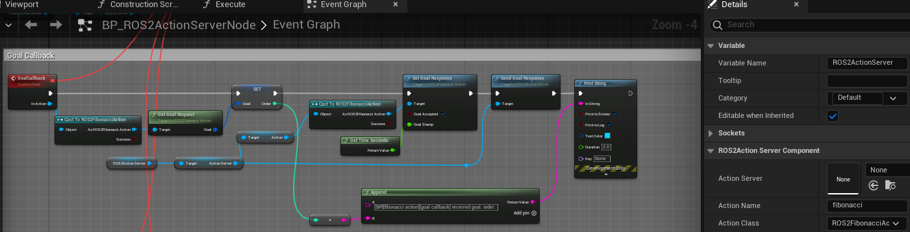

=============================
Action Server Example
=============================

Please follow the instructions in  :ref:`setup_and_run_ue_project` to setup the UE project 
and open  `ROS2ActionExample.umap <https://github.com/rapyuta-robotics/turtlebot3-UE/blob/devel/Content/Maps/ROS2TopicExamples.umap>`_.

-----------------------------
C++ Action Server
-----------------------------

This example send next action goal when received action result.

^^^^^^^^^^^^^^^^^^
Code
^^^^^^^^^^^^^^^^^^

.. code-block:: C++

    //ROS2ActionServerNode.h

    UCLASS()
    class TURTLEBOT3_API AROS2ActionServerNode : public AActor
    {
        GENERATED_BODY()

    public:
        AROS2ActionServerNode();

        virtual void BeginPlay() override;

        UPROPERTY(EditAnywhere, BlueprintReadWrite)
        UROS2NodeComponent* Node = nullptr;

        UPROPERTY(EditAnywhere, BlueprintReadWrite)
        UROS2ActionServer* FibonacciActionServer = nullptr;

        UPROPERTY(EditAnywhere, BlueprintReadWrite)
        FString ActionName = TEXT("fibonacci_action");

        UPROPERTY()
        FTimerHandle ActionTimerHandle;

        UFUNCTION()
        void Execute();

        UFUNCTION()
        void GoalCallback(UROS2GenericAction* InAction);
        UFUNCTION()
        void CancelCallback();
        UFUNCTION()
        void ResultCallback();

    private:
        FROSFibonacciFB FeedbackMsg;
        FROSFibonacciSGReq GoalRequest;
        int Count = 0;
    };

.. code-block:: C++

    //AROS2ActionServerNode.cpp

    AROS2ActionServerNode::AROS2ActionServerNode()
    {
        Node = CreateDefaultSubobject<UROS2NodeComponent>(TEXT("ROS2NodeComponent"));

        // these parameters can be change from BP
        Node->Name = TEXT("action_server_node");
        Node->Namespace = TEXT("cpp");
    }

    void AROS2ActionServerNode::BeginPlay()
    {
        Super::BeginPlay();
        Node->Init();

        ROS2_CREATE_ACTION_SERVER(Node,
                                this,
                                ActionName,
                                UROS2FibonacciAction::StaticClass(),
                                &AROS2ActionServerNode::GoalCallback,
                                &AROS2ActionServerNode::ResultCallback,
                                &AROS2ActionServerNode::CancelCallback,
                                FibonacciActionServer);
    }

    void AROS2ActionServerNode::Execute()
    {
        UROS2FibonacciAction* FibonacciAction = Cast<UROS2FibonacciAction>(FibonacciActionServer->Action);

        // send feedback
        if (Count++ <= GoalRequest.Order)
        {
            FeedbackMsg.Sequence.Add(FeedbackMsg.Sequence[Count] + FeedbackMsg.Sequence[Count - 1]);
            FibonacciAction->SetFeedback(FeedbackMsg);
            // Log request and response
            UE_LOG_WITH_INFO_NAMED(
                LogTurtlebot3, Log, TEXT("[%s][C++][update feedback] added %d"), *ActionName, FeedbackMsg.Sequence.Last(0));
            FibonacciActionServer->SendFeedback();
        }
        // send result when finish by UpdateAndSendResult
        else
        {
            // for log
            FString resultString;

            // set result
            FROSFibonacciGRRes ResultResponse;
            ResultResponse.GRResStatus = GOAL_STATE_SUCCEEDED;
            for (auto s : FeedbackMsg.Sequence)
            {
                ResultResponse.Sequence.Add(s);
                resultString += FString::FromInt(s) + ", ";
            }
            FibonacciAction->SetResultResponse(ResultResponse);
            FibonacciActionServer->SendResultResponse();

            // stop timer
            GetWorld()->GetTimerManager().ClearTimer(ActionTimerHandle);

            // Log request and response
            UE_LOG_WITH_INFO_NAMED(LogTurtlebot3, Log, TEXT("[%s][C++][send result] result is: %s"), *ActionName, *resultString);
            ;
        }
    }

    void AROS2ActionServerNode::GoalCallback(UROS2GenericAction* InAction)
    {
        // retrieve goal request value
        UROS2FibonacciAction* FibonacciAction = Cast<UROS2FibonacciAction>(InAction);
        FibonacciAction->GetGoalRequest(GoalRequest);

        // set and send goal response
        FROSFibonacciSGRes goalResponse;
        goalResponse.bAccepted = true;    // always accept goal
        goalResponse.Stamp = UGameplayStatics::GetTimeSeconds(reinterpret_cast<UObject*>(GetWorld()));
        Cast<UROS2FibonacciAction>(FibonacciActionServer->Action)->SetGoalResponse(goalResponse);
        FibonacciActionServer->SendGoalResponse();

        // Log request and response
        UE_LOG_WITH_INFO_NAMED(LogTurtlebot3, Log, TEXT("[%s][C++][goal callback]"), *ActionName);
    }

    void AROS2ActionServerNode::CancelCallback()
    {
        // stop execution timer
        GetWorld()->GetTimerManager().ClearTimer(ActionTimerHandle);

        // send cancel response. always success
        FibonacciActionServer->ProcessAndSendCancelResponse(FROSCancelGoalRes::ERROR_NONE);

        // Log request and response
        UE_LOG_WITH_INFO_NAMED(LogTurtlebot3, Log, TEXT("[%s][C++][cancle callback]"), *ActionName);
    }

    void AROS2ActionServerNode::ResultCallback()
    {
        // initialize feedback msg
        Cast<UROS2FibonacciAction>(FibonacciActionServer->Action)->SetGoalIdToFeedback(FeedbackMsg);
        FeedbackMsg.Sequence.Empty();
        FeedbackMsg.Sequence.Add(0);
        FeedbackMsg.Sequence.Add(1);
        Count = 0;

        // set timer to execute action.
        GetWorld()->GetTimerManager().SetTimer(ActionTimerHandle, this, &AROS2ActionServerNode::Execute, 1.f, true);

        // Log request and response
        UE_LOG_WITH_INFO_NAMED(LogTurtlebot3, Log, TEXT("[%s][C++][result callback] Start fibonacci calculation"), *ActionName);
    }

^^^^^^^^^^^^^^^^^^
Examin the code
^^^^^^^^^^^^^^^^^^

On an AROS2ActionServerNode Actor, similar to the AROS2PublisherrNode, 
NodeComponent is created and initialized in the constructor but ROS2 Node is not created here.
Please check :ref:`publisher_examin_code` for the reason.

.. code-block:: C++

    AROS2ActionServerNode::AROS2ActionServerNode()
    {
        Node = CreateDefaultSubobject<UROS2NodeComponent>(TEXT("ROS2NodeComponent"));

        // these parameters can be change from BP
        Node->Name = TEXT("action_server_node");
        Node->Namespace = TEXT("cpp");
    }

When the simulation starts, BeginPlay is called. 
In BeginPlay, firstly create and initialize the ROS2 Node by calling 
`UROS2NodeComponent::Init  <../doxygen_generated/html/d7/d68/class_u_r_o_s2_node_component.html#ab9b7b990c4ca38eb60acf8e0a53c3e52>`_
.

.. code-block:: C++

    void AROS2ActionServerNode::BeginPlay()
    {
        Super::BeginPlay();
        Node->Init();

You can create a action server by using the 
`ROS2_CREATE_ACTION_SERVER <../doxygen_generated/html/d1/d79/_r_o_s2_node_component_8h.html#a87d0edc6f7bfde247b8ef211c4b43682>`_ 
macro, which creates a action server and adds it to the node. 
This macro bound Goal, Result and Cancel callback functions to the action server.

.. code-block:: C++

    // Create Action server
    ROS2_CREATE_ACTION_SERVER(Node,
                            this,
                            ActionName,
                            UROS2FibonacciAction::StaticClass(),
                            &AROS2ActionServerNode::GoalCallback,
                            &AROS2ActionServerNode::ResultCallback,
                            &AROS2ActionServerNode::CancelCallback,
                            FibonacciActionServer);
                                    
The implementation of ROS2_CREATE_ACTION_SERVER is as follows. 
It uses Unreal Engine's dynamic delegate to call the bound function 
when the node receives the message. 
You can find more information about Unreal Engine's dynamic delegate .
`here <https://docs.unrealengine.com/5.1/en-US/dynamic-delegates-in-unreal-engine/>`_.

.. code-block:: C++

    DECLARE_DYNAMIC_DELEGATE_OneParam(FActionCallback, UROS2GenericAction*, InAction /*Action*/);

    #define ROS2_CREATE_ACTION_SERVER(                                                                                        \
    InROS2Node, InUserObject, InActionName, InActionClass, InGoalDelegate, InResultDelegate, InCancelDelegate, OutServer) \
    if (ensure(IsValid(InROS2Node)))                                                                                      \
    {                                                                                                                     \
        FActionCallback Goal;                                                                                             \
        FSimpleCallback Result, Cancel;                                                                                   \
        Goal.BindDynamic(InUserObject, InGoalDelegate);                                                                   \
        Result.BindDynamic(InUserObject, InResultDelegate);                                                               \
        Cancel.BindDynamic(InUserObject, InCancelDelegate);                                                               \
        OutServer = InROS2Node->CreateActionServer(InActionName, InActionClass, Goal, Result, Cancel);                    \
    }

AROS2ActionServerNode has GoalRequest and FeedbackMsg variables use data in Execute method.
    
.. code-block:: C++

    private:
        FROSFibonacciFB FeedbackMsg;
        FROSFibonacciSGReq GoalRequest;
        int Count = 0;

When the node receives a action Result/Goal/Cancel, corresponding callback function is called.
for the corresponding action (UROS2FibonacciAction) and 
retrieve the goal by calling GetGoalRequest. 

After setting response, send goal response by calling SendGoalResponse. 
In this example goal is always accepted.

.. code-block:: C++

    void AROS2ActionServerNode::GoalCallback(UROS2GenericAction* InAction)
    {
        // retrieve goal request value
        UROS2FibonacciAction* FibonacciAction = Cast<UROS2FibonacciAction>(InAction);
        FibonacciAction->GetGoalRequest(GoalRequest);

        // set and send goal response
        FROSFibonacciSGRes goalResponse;
        goalResponse.bAccepted = true;    // always accept goal
        goalResponse.Stamp = UGameplayStatics::GetTimeSeconds(reinterpret_cast<UObject*>(GetWorld()));
        Cast<UROS2FibonacciAction>(FibonacciActionServer->Action)->SetGoalResponse(goalResponse);
        FibonacciActionServer->SendGoalResponse();

        // Log request and response
        UE_LOG_WITH_INFO_NAMED(LogTurtlebot3, Log, TEXT("[%s][C++][goal callback]"), *ActionName);
    }

ResultCallback intialize Feedback and Count and set timer to execute action.

.. code-block:: C++

    void AROS2ActionServerNode::ResultCallback()
    {
        // initialize feedback msg
        Cast<UROS2FibonacciAction>(FibonacciActionServer->Action)->SetGoalIdToFeedback(FeedbackMsg);
        FeedbackMsg.Sequence.Empty();
        FeedbackMsg.Sequence.Add(0);
        FeedbackMsg.Sequence.Add(1);
        Count = 0;

        // set timer to execute action.
        GetWorld()->GetTimerManager().SetTimer(ActionTimerHandle, this, &AROS2ActionServerNode::Execute, 1.f, true);

        // Log request and response
        UE_LOG_WITH_INFO_NAMED(LogTurtlebot3, Log, TEXT("[%s][C++][result callback] Start fibonacci calculation"), *ActionName);
    }

Execute is periodically called by timer started by ResultCallback.
In Execute, If Count is less than Order, execute fibonacci calculation, send feedback and increment Count.
If Count reach Order, send result response by calling SendResultResponse and stop timer.

.. code-block:: C++

    void AROS2ActionServerNode::Execute()
    {
        UROS2FibonacciAction* FibonacciAction = Cast<UROS2FibonacciAction>(FibonacciActionServer->Action);

        // send feedback
        if (Count++ <= GoalRequest.Order)
        {
            FeedbackMsg.Sequence.Add(FeedbackMsg.Sequence[Count] + FeedbackMsg.Sequence[Count - 1]);
            FibonacciAction->SetFeedback(FeedbackMsg);
            // Log request and response
            UE_LOG_WITH_INFO_NAMED(
                LogTurtlebot3, Log, TEXT("[%s][C++][update feedback] added %d"), *ActionName, FeedbackMsg.Sequence.Last(0));
            FibonacciActionServer->SendFeedback();
        }
        // send result when finish by UpdateAndSendResult
        else
        {
            // for log
            FString resultString;

            // set result
            FROSFibonacciGRRes ResultResponse;
            ResultResponse.GRResStatus = GOAL_STATE_SUCCEEDED;
            for (auto s : FeedbackMsg.Sequence)
            {
                ResultResponse.Sequence.Add(s);
                resultString += FString::FromInt(s) + ", ";
            }
            FibonacciAction->SetResultResponse(ResultResponse);
            FibonacciActionServer->SendResultResponse();

            // stop timer
            GetWorld()->GetTimerManager().ClearTimer(ActionTimerHandle);

            // Log request and response
            UE_LOG_WITH_INFO_NAMED(LogTurtlebot3, Log, TEXT("[%s][C++][send result] result is: %s"), *ActionName, *resultString);
            ;
        }
    }

When cancel request is received, stop timer and send cancel response.

.. code-block:: C++

    void AROS2ActionServerNode::CancelCallback()
    {
        // stop execution timer
        GetWorld()->GetTimerManager().ClearTimer(ActionTimerHandle);

        // send cancel response. always success
        FibonacciActionServer->ProcessAndSendCancelResponse(FROSCancelGoalRes::ERROR_NONE);

        // Log request and response
        UE_LOG_WITH_INFO_NAMED(LogTurtlebot3, Log, TEXT("[%s][C++][cancle callback]"), *ActionName);
    }

-----------------------------
BP Action Server
-----------------------------

Blueprint implementation of a action server is very similar to a C++ implementation. 
Blueprints allow you to set logic/processes, parameters, and other details from the editor.

You can add component such as UROS2Publisher from `Components` panel in the editor(left side in the fig below)
and set each component parameters in `Details` panel in the editor(right side in the fig below).

The main difference from the C++ implementation is that it uses 
`UROS2ActionServerComponent <../doxygen_generated/html/d2/d74/class_u_r_o_s2_action_server_component.html>`_
instead of UROS2ActionServer. 
As UROS2ActionServerComponent is a child class of 
`UActorComponent <https://docs.unrealengine.com/5.1/en-US/API/Runtime/Engine/Components/UActorComponent/>`_
and has UROS2ActionServer as a member variable, you can easily add it to the Actor and set parameters from the editor.

The Action server component is attached to an Actor, which is displayed in the `Components` panel on the left.

Initialize the ROS2 Node using the BeginPlay event. 
You can set the ROSNode parameters, such as Name and Namespace, 
from the `Details` panel on the right.

Compared to C++, which uses ROS2_CREATE_ACTION_SERVER, 
in Blueprint, the action server is already generated as a Component before BeginPlay. 
Therefore, we use 
`UROS2NodeComponent::AddActionServer <../doxygen_generated/html/d7/d68/class_u_r_o_s2_node_component.html#a83cd0ecbdb3d6b97e3b2b7171408e2ad>`_
to initialize the Subscriber and 
`UROS2ActionServer::SetDelegates <../doxygen_generated/html/d8/d1f/class_u_r_o_s2_action_server.html#a533811c5b7bed9042085bf13b76066f5>`_ 
to bind callback methods instead. 
The ROS2_CREATE_ACTION_SERVER macro in C++ internally calls CreateActionServer which calls AddActionServer and SetDelegates.

GoalCallback send goal response by calling SendGoalResponse. In this example goal is always accepted.

Result Callback method initialize the feedback and start timer to periodically calls Execute function.

Execute function update fibonacci sequence and send feedback or result.
Top white block, update fibonacci sequence,

Center SendFeedback block is executed if current count is less than order. 

Bottom SendResult is executed if current count is equal to order.

CancelCallback clear the timer and send cancel response.