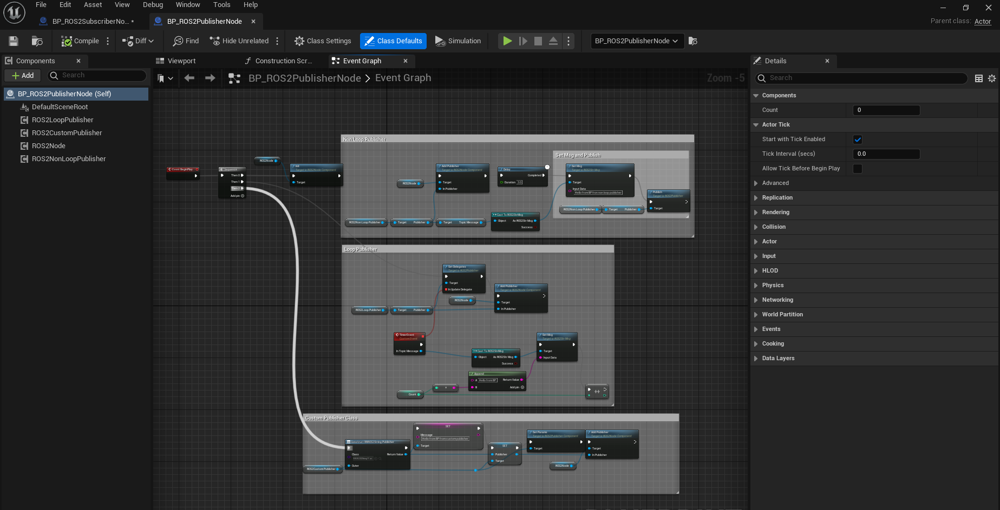
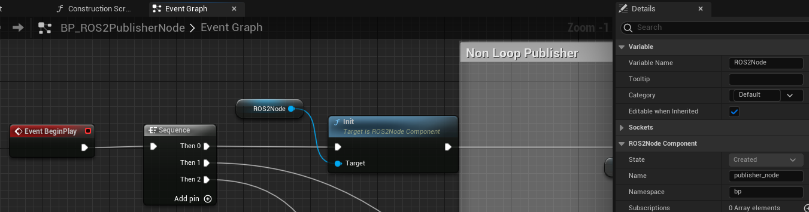
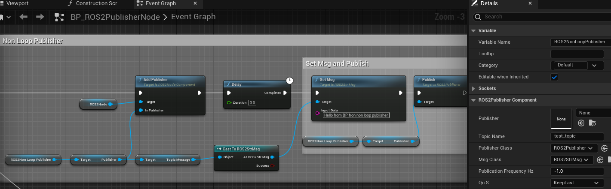
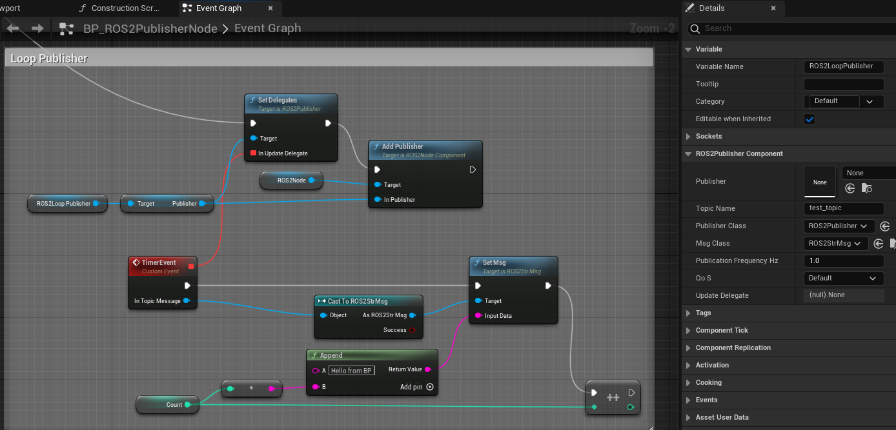
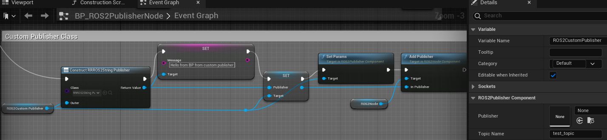

=============================
Publisher Example
=============================

Please follow the instructions in  :ref:`setup_and_run_ue_project` to set up the UE project 
and open `ROS2TopicExample.umap <https://github.com/rapyuta-robotics/turtlebot3-UE/blob/devel/Content/Maps/ROS2TopicExamples.umap>`_.

-----------------------------
C++ Publisher
-----------------------------

^^^^^^^^^^^^^^^^^^
Code
^^^^^^^^^^^^^^^^^^

.. code-block:: C++

    //ROS2PublisherNode.h

    UCLASS()
    class TURTLEBOT3_API AROS2PublisherNode : public AActor
    {
        GENERATED_BODY()

    public:
        AROS2PublisherNode();

        virtual void BeginPlay() override;

        UFUNCTION()
        void UpdateMessage(UROS2GenericMsg* InMessage);

        UPROPERTY(EditAnywhere, BlueprintReadWrite)
        UROS2NodeComponent* Node = nullptr;

        UPROPERTY(EditAnywhere, BlueprintReadWrite)
        UROS2Publisher* Publisher = nullptr;

        UPROPERTY(EditAnywhere, BlueprintReadWrite)
        UROS2Publisher* LoopPublisher = nullptr;

        UPROPERTY(EditAnywhere, BlueprintReadWrite)
        URRROS2StringPublisher* StringPublisher = nullptr;

        UPROPERTY(EditAnywhere, BlueprintReadWrite)
        FString TopicName = TEXT("test_topic");

        UPROPERTY(EditAnywhere, BlueprintReadWrite)
        float PublicationFrequencyHz = 1.f;

        UPROPERTY(EditAnywhere, BlueprintReadWrite)
        FString Message = TEXT("Hello from C++");

        UPROPERTY()
        int32 Count = 0;
    };

.. code-block:: C++

    //ROS2PublisherNode.cpp

    AROS2PublisherNode::AROS2PublisherNode()
    {
        Node = CreateDefaultSubobject<UROS2NodeComponent>(TEXT("ROS2NodeComponent"));

        // these parameters can be change from BP
        Node->Name = TEXT("publisher_node");
        Node->Namespace = TEXT("cpp");
    }

    void AROS2PublisherNode::BeginPlay()
    {
        Super::BeginPlay();

        Node->Init();

        // Create publisher with 3 different way.
        // 1. Non Loop Publisher
        // 2. Loop Publisher
        // 3. Custom Publisher class

        // 1. Non Loop Publisher
        // 1.1 Create publisher
        Publisher = Node->CreatePublisher(TopicName, UROS2Publisher::StaticClass(), UROS2StrMsg::StaticClass(), UROS2QoS::KeepLast);

        // 1.2 Create msg
        FROSStr msg;
        msg.Data = FString::Printf(TEXT("%s from non loop publisher"), *Message);
        CastChecked<UROS2StrMsg>(Publisher->TopicMessage)->SetMsg(msg);

        // 1.3 publish
        Publisher->Publish();

        // 2. Loop Publisher
        ROS2_CREATE_LOOP_PUBLISHER_WITH_QOS(Node,
                                            this,
                                            TopicName,
                                            UROS2Publisher::StaticClass(),
                                            UROS2StrMsg::StaticClass(),
                                            PublicationFrequencyHz,
                                            &AROS2PublisherNode::UpdateMessage,
                                            UROS2QoS::Default,
                                            LoopPublisher);

        // 3. Use Custom Publisher class
        // UpdateMessage is overriden in child class.
        StringPublisher = CastChecked<URRROS2StringPublisher>(
            Node->CreateLoopPublisherWithClass(TopicName, URRROS2StringPublisher::StaticClass(), 1.f));
        StringPublisher->Message = FString::Printf(TEXT("%s from custom class"), *Message);
    }

    void AROS2PublisherNode::UpdateMessage(UROS2GenericMsg* InMessage)
    {
        FROSStr msg;
        msg.Data = FString::Printf(TEXT("%s %d"), *Message, Count++);
        CastChecked<UROS2StrMsg>(InMessage)->SetMsg(msg);
    }

.. _publisher_examin_code:

^^^^^^^^^^^^^^^^^^
Code explanations
^^^^^^^^^^^^^^^^^^

In the constructor, 
the `UROS2NodeComponent <../doxygen_generated/html/d7/d68/class_u_r_o_s2_node_component.html>`_ 
is created using 
`CreateDefaultSubobject <https://docs.unrealengine.com/4.26/en-US/API/Runtime/CoreUObject/UObject/UObject/CreateDefaultSubobject/2/>`_  
and its parameters such as Node Name and Namespace are set.

Although the UROS2NodeComponent is created, 
the ROS2 Node is not yet initialized at this point. 
Initialization of the ROS2 Node occurs during the 
`BeginPlay <https://docs.unrealengine.com/5.1/en-US/API/Runtime/Engine/GameFramework/AActor/BeginPlay/>`_ 
method, which is called when the simulation starts.

One reason to initialize in BeginPlay is to create a ROS2 Node when the simulation starts. 
It is important to note that the UE Class constructor may also be called before simulation start, for example, 
when an Actor is placed in the level. For a better understanding of Actor Lifecycle, please refer to the
`UE Actor LifeCycle <https://docs.unrealengine.com/5.1/en-US/unreal-engine-actor-lifecycle/>`_ 
However, understanding the entire lifecycle is not necessary to use rclUE.

Another significant difference is that by initializing in BeginPlay, 
variables such as publication frequency can be set in the editor and 
their changes will be reflected when running the simulation.
If, in contrast, we initialize things in the constructor,
variables changed in the editor would not reflect in the simulation,
unless we restart the editor.

.. code-block:: C++

    AROS2PublisherNode::AROS2PublisherNode()
    {
        Node = CreateDefaultSubobject<UROS2NodeComponent>(TEXT("ROS2NodeComponent"));

        // these parameters can be change from BP
        Node->Name = TEXT("publisher_node");
        Node->Namespace = TEXT("cpp");
    }

When simulation starts, BeginPlay is called. In the BeginPlay, 
firstly create and initialize ROS2 Node by calling
`UROS2NodeComponent::Init  <../doxygen_generated/html/d7/d68/class_u_r_o_s2_node_component.html#ab9b7b990c4ca38eb60acf8e0a53c3e52>`_
.

.. code-block:: C++

    void AROS2PublisherNode::BeginPlay()
    {
        Super::BeginPlay();

        Node->Init();

then starts adding publishers. We introduce 3 ways to add publisher here.

Non Loop Publisher
~~~~~~~~~~~~~~~~~~~~~~

This will create a publisher and publish a message once. 
It is a straightforward way to publish a message, 
involving creating a publisher, creating a message, and publishing the message.

To create a publisher, use 
`UROS2NodeComponent::CreatePublisher  <../doxygen_generated/html/d7/d68/class_u_r_o_s2_node_component.html#a5a7cb19de75e1970894efe2dcb4ac57c>`_

Create a structure (FROSStr) for the contrasting message (UROSStrMsg) and 
assign characters to the Data field. 
Then, assign the structure to the message using the SetMsg method.

Finally, call the 
`UROS2Publisher::Publish <../doxygen_generated/html/d6/dd4/class_u_r_o_s2_publisher.html#a1c80608e01c7bdeb74ffe3bb82112222>`_ 
method to publish the topic.

.. code-block:: C++

        // 1. Non Loop Publisher
        // 1.1 Create publisher
        Publisher = Node->CreatePublisher(TopicName, UROS2Publisher::StaticClass(), UROS2StrMsg::StaticClass(), UROS2QoS::KeepLast);

        // 1.2 Create msg
        FROSStr msg;
        msg.Data = FString::Printf(TEXT("%s from non loop publisher"), *Message);
        CastChecked<UROS2StrMsg>(Publisher->TopicMessage)->SetMsg(msg);

        // 1.3 publish
        Publisher->Publish();

Loop Publisher
~~~~~~~~~~~~~~~~~~~~~~

You can create a loop publisher by using the 
`ROS2_CREATE_LOOP_PUBLISHER_WITH_QOS <../doxygen_generated/html/d1/d79/_r_o_s2_node_component_8h.html#aa037d93e1d31d5436f12553248889060>`_
macro. 
This macro creates a publisher and adds it to the node, 
and then it periodically calls the AROS2PublisherNode::UpdateMessage method.

.. code-block:: C++

        // 2. Loop Publisher
        ROS2_CREATE_LOOP_PUBLISHER_WITH_QOS(Node,
                                            this,
                                            TopicName,
                                            UROS2Publisher::StaticClass(),
                                            UROS2StrMsg::StaticClass(),
                                            PublicationFrequencyHz,
                                            &AROS2PublisherNode::UpdateMessage,
                                            UROS2QoS::Default,
                                            LoopPublisher);

UpdateMessage method does similar things as a non-loop publisher. 
Since the loop publisher automatically calls the "Publish()" method, 
you only need to create and set the message.

.. code-block:: C++

    void AROS2PublisherNode::UpdateMessage(UROS2GenericMsg* InMessage)
    {
        FROSStr msg;
        msg.Data = FString::Printf(TEXT("%s %d"), *Message, Count++);
        CastChecked<UROS2StrMsg>(InMessage)->SetMsg(msg);
    }

The implementation of ROS2_CREATE_LOOP_PUBLISHER_WITH_QOS is as follows. 
It uses Unreal Engine's dynamic delegate to call a bound function periodically. 
You can find more information about Unreal Engine's dynamic delegate 
`here <https://docs.unrealengine.com/5.1/en-US/dynamic-delegates-in-unreal-engine/>`_.

.. code-block:: C++

    DECLARE_DYNAMIC_DELEGATE_OneParam(FTopicCallback, UROS2GenericMsg*, InTopicMessage);

    #define ROS2_CREATE_LOOP_PUBLISHER_WITH_QOS(                                                                                  \
        InROS2Node, InUserObject, InTopicName, InPublisherClass, InMsgClass, InPubFrequency, InCallback, InQoS, OutPublisher)     \
        if (ensure(IsValid(InROS2Node)))                                                                                          \
        {                                                                                                                         \
            FTopicCallback cb;                                                                                                    \
            cb.BindDynamic(InUserObject, InCallback);                                                                             \
            OutPublisher = InROS2Node->CreateLoopPublisher(InTopicName, InPublisherClass, InMsgClass, InPubFrequency, cb, InQoS); \
        }

Custom Publisher class
~~~~~~~~~~~~~~~~~~~~~~

You can create a publisher by defining a child class of UROS2Publisher. 
This is useful when you want to add some custom logic to the publisher that will be used in multiple places.

.. code-block:: C++

        // 3. Use Custom Publisher class
        // UpdateMessage is overriden in child class.
        StringPublisher = CastChecked<URRROS2StringPublisher>(
            Node->CreateLoopPublisherWithClass(TopicName, URRROS2StringPublisher::StaticClass(), 1.f));
        StringPublisher->Message = FString::Printf(TEXT("%s from custom class"), *Message);

The implementation of UROS2StringPublisher is as follows. 
UROS2StringPublisher is a child class of UROS2Publisher.

The constructor is used to set default publisher settings. 
You can add user-defined logic by overriding the UpdateMessage method, 
which is called periodically if PublicationFrequencyHz > 0.

.. code-block:: C++

    // RRROS2StringPublisher.cpp
    #include "Msgs/ROS2Str.h"

    URRROS2StringPublisher::URRROS2StringPublisher()
    {
        MsgClass = UROS2StrMsg::StaticClass();
        PublicationFrequencyHz = 1;
        QoS = UROS2QoS::DynamicBroadcaster;
        SetDefaultDelegates();    //use UpdateMessage as update delegate
    }

    void URRROS2StringPublisher::UpdateMessage(UROS2GenericMsg* InMessage)
    {
        FROSStr msg;
        msg.Data = Message;
        CastChecked<UROS2StrMsg>(InMessage)->SetMsg(msg);
    }

-----------------------------
BP Publisher
-----------------------------

Blueprint implementation of a publisher is very similar to a C++ implementation. 
Blueprints allow you to set logic/processes, parameters, and other details from the editor.

You can add component such as UROS2Publisher from `Components` panel in the editor(left side in the fig below)
and set each component parameters in `Details` panel in the editor(right side in the fig below).

\* Please enlarge the image if the font is too small, or open the BP class in the editor.

^^^^^^^^^^^^^^^^^^^^^^^^^^^^^^^^^^^^
Overview of BP Publisher
^^^^^^^^^^^^^^^^^^^^^^^^^^^^^^^^^^^^

Similar to the C++ implementation, the BP class has three types of publishers: 
Non-Loop Publisher, Loop Publisher, and Custom Publisher.

The main difference from the C++ implementation is that it uses 
`UROS2PublisherComponent <../doxygen_generated/html/db/d27/class_u_r_o_s2_publisher_component.html>`_
instead of UROS2Publisher. 
As UROS2PublisherComponent is a child class of `UActorComponent <https://docs.unrealengine.com/5.1/en-US/API/Runtime/Engine/Components/UActorComponent/>`_
and has UROS2Publisher as a member variable, you can easily add it to the Actor and set parameters from the editor.

Each publisher is attached to an Actor, which is displayed in the `Components`` panel on the left.

^^^^^^^^^^^^^^^^^^^^^^^^^^^^^^^^^^^^
Details of BP Publisher
^^^^^^^^^^^^^^^^^^^^^^^^^^^^^^^^^^^^

Initialize the ROS2 Node using the BeginPlay event. 
You can set the ROSNode parameters, such as Name and Namespace, 
from the `Details` panel on the right.

Non Loop Publisher
~~~~~~~~~~~~~~~~~~~~~~

Compared to C++, which uses CreatePublisher(), 
in Blueprint, the Publisher is already generated as a Component before BeginPlay. 
Therefore, we use 
`UROS2NodeComponent::AddPublisher <../doxygen_generated/html/d7/d68/class_u_r_o_s2_node_component.html#a582299af64efaaa34b046c00b1c96828>_` 
to initialize the Publisher instead. 
The CreatePublisher function in C++ internally calls AddPublisher.

You can see that parameters such as Topic Name, Publisher Class, and Msg Class are set in the right `Details`` panel.

Loop Publisher
~~~~~~~~~~~~~~~~~~~~~~

Callback function is bound to a custom event, indicated by the red node in the center. 
This callback function is executed at regular intervals with a specified frequency.

Custom Publisher class
~~~~~~~~~~~~~~~~~~~~~~

To set parameters for a custom publisher object, 
we need to create a variable of the custom publisher class and then assign it to the publisher component.
