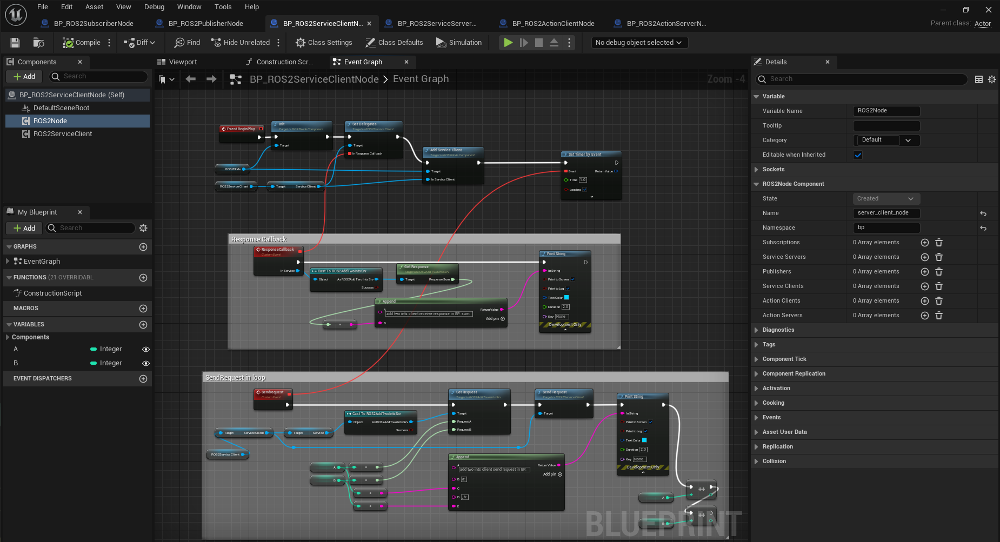
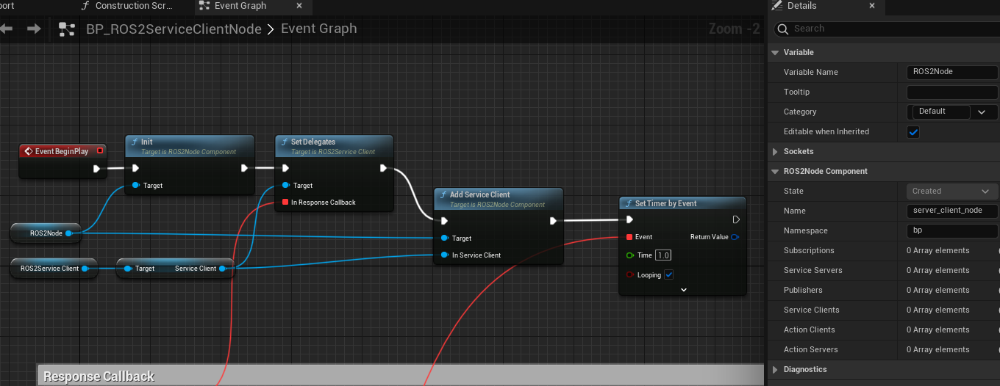
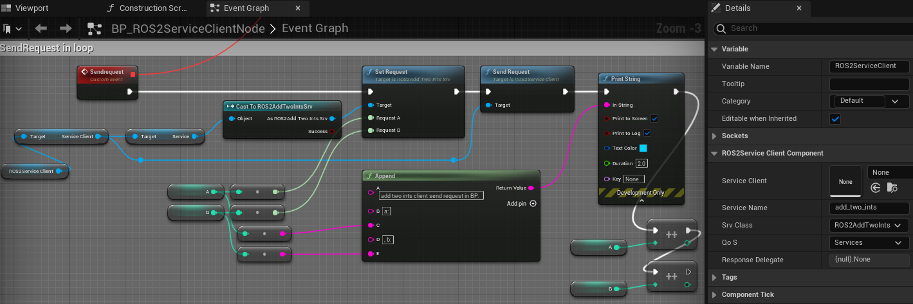
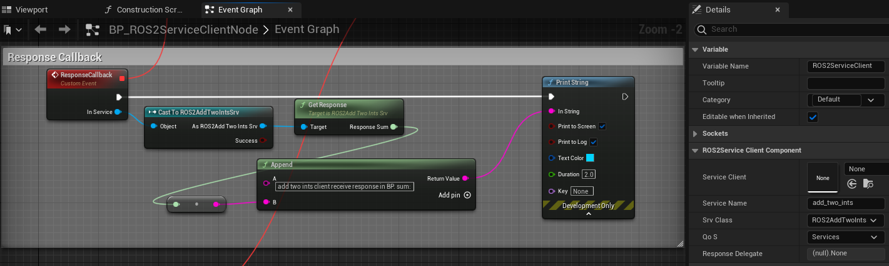

=============================
Service Client Example
=============================

Please follow the instructions in  :ref:`setup_and_run_ue_project` to setup the UE project 
and open  `ROS2ServiceExample.umap <https://github.com/rapyuta-robotics/turtlebot3-UE/blob/devel/Content/Maps/ROS2TopicExamples.umap>`_.

-----------------------------
C++ Service Client
-----------------------------

This example send service request every 1 second.

^^^^^^^^^^^^^^^^^^
Code
^^^^^^^^^^^^^^^^^^

.. code-block:: C++

    //ROS2ServiceClientNode.h

    UCLASS()
    class TURTLEBOT3_API AROS2ServiceClientNode : public AActor
    {
        GENERATED_BODY()

    protected:
        AROS2ServiceClientNode();

        virtual void BeginPlay() override;

        UPROPERTY(EditAnywhere, BlueprintReadWrite)
        UROS2NodeComponent* Node = nullptr;

        UPROPERTY(EditAnywhere, BlueprintReadWrite)
        UROS2ServiceClient* AddTwoIntsSrvClient = nullptr;

        UPROPERTY(EditAnywhere, BlueprintReadWrite)
        FString ServiceName = TEXT("add_two_ints");

        //! AddTwoInts input
        UPROPERTY(EditAnywhere, BlueprintReadWrite)
        int A = 1;

        //! AddTwoInts input
        UPROPERTY(EditAnywhere, BlueprintReadWrite)
        int B = 2;

        /**
        * @brief
        * This method is bounded with AddTwoIntsSrvClient::RequestDelegate in #BeginPlay
        * and called when receive response.
        * @param InService
        */
        UFUNCTION()
        void ReceiveResponse(UROS2GenericSrv* InService);

        UPROPERTY()
        FTimerHandle TimerHandle;
    };

.. code-block:: C++

    //AROS2ServiceClientNode.cpp

    AROS2ServiceClientNode::AROS2ServiceClientNode()
    {
        Node = CreateDefaultSubobject<UROS2NodeComponent>(TEXT("ROS2NodeComponent"));

        // these parameters can be change from BP
        Node->Name = TEXT("service_client_node");
        Node->Namespace = TEXT("cpp");
    }

    void AROS2ServiceClientNode::BeginPlay()
    {
        Super::BeginPlay();
        Node->Init();

        // Create Service client
        ROS2_CREATE_SERVICE_CLIENT_WITH_QOS(Node,
                                            this,
                                            ServiceName,
                                            UROS2AddTwoIntsSrv::StaticClass(),
                                            &AROS2ServiceClientNode::ReceiveResponse,    // Callback for response
                                            UROS2QoS::DynamicBroadcaster,
                                            AddTwoIntsSrvClient)

        // set timer to periodically calling service.
        FTimerDelegate sendRequest = FTimerDelegate::CreateLambda(
            [this]
            {
                // Create request
                FROSAddTwoIntsReq req;
                req.A = A++;
                req.B = B++;
                CastChecked<UROS2AddTwoIntsSrv>(AddTwoIntsSrvClient->Service)->SetRequest(req);

                // SendRequest
                AddTwoIntsSrvClient->SendRequest();

                // Log request
                UE_LOG_WITH_INFO_NAMED(LogTurtlebot3, Log, TEXT("[%s][C++][send request] a:%d, b:%d"), *ServiceName, req.A, req.B);
            });

        GetWorld()->GetTimerManager().SetTimer(TimerHandle, sendRequest, 1.0f, true);
    }

    void AROS2ServiceClientNode::ReceiveResponse(UROS2GenericSrv* InService)
    {
        UROS2AddTwoIntsSrv* AddTwoIntsService = Cast<UROS2AddTwoIntsSrv>(InService);

        FROSAddTwoIntsRes res;
        AddTwoIntsService->GetResponse(res);

        // Log response
        UE_LOG_WITH_INFO_NAMED(LogTurtlebot3, Log, TEXT("[%s][C++][receive response] sum:%d"), *ServiceName, res.Sum);
    }

^^^^^^^^^^^^^^^^^^
Examin the code
^^^^^^^^^^^^^^^^^^

On an AROS2ServiceClientNode Actor, similar to the AROS2PublisherrNode, 
NodeComponent is created and initialized in the constructor but ROS2 Node is not created here.
Please check :ref:`publisher_examin_code` for the reason.

.. code-block:: C++

    AROS2ServiceClientNode::AROS2ServiceClientNode()
    {
        Node = CreateDefaultSubobject<UROS2NodeComponent>(TEXT("ROS2NodeComponent"));

        // these parameters can be change from BP
        Node->Name = TEXT("service_client_node");
        Node->Namespace = TEXT("cpp");
    }

When the simulation starts, BeginPlay is called. 
In BeginPlay, firstly create and initialize the ROS2 Node by calling 
`UROS2NodeComponent::Init  <../doxygen_generated/html/d7/d68/class_u_r_o_s2_node_component.html#ab9b7b990c4ca38eb60acf8e0a53c3e52>`_
.

.. code-block:: C++

    void AROS2ServiceClientNode::BeginPlay()
    {
        Super::BeginPlay();
        Node->Init();

You can create a service client by using the 
`ROS2_CREATE_SERVICE_CLIENT_WITH_QOS <../doxygen_generated/html/d1/d79/_r_o_s2_node_component_8h.html#afc35f3065562037d23b39eb0baa32f0d>`_ 
macro, which creates a service client and adds it to the node. 
When the node receives a service response, AROS2ServiceClientNode::ReceiveResponse is called.

.. code-block:: C++

    // Create Service client
    ROS2_CREATE_SERVICE_CLIENT_WITH_QOS(Node,
                                        this,
                                        ServiceName,
                                        UROS2AddTwoIntsSrv::StaticClass(),
                                        &AROS2ServiceClientNode::ReceiveResponse,    // Callback for response
                                        UROS2QoS::DynamicBroadcaster,
                                        AddTwoIntsSrvClient)
                                        
The implementation of ROS2_CREATE_SERVICE_CLIENT_WITH_QOS is as follows. 
It uses Unreal Engine's dynamic delegate to call the bound function 
when the node receives the message. 
You can find more information about Unreal Engine's dynamic delegate .
`here <https://docs.unrealengine.com/5.1/en-US/dynamic-delegates-in-unreal-engine/>`_.

.. code-block:: C++

    DECLARE_DYNAMIC_DELEGATE_OneParam(FServiceCallback, UROS2GenericSrv*, InService /*Service*/);

    #define ROS2_CREATE_SERVICE_CLIENT_WITH_QOS(                                                  \
        InROS2Node, InUserObject, InServiceName, InSrvClass, InRequestCallback, InQoS, OutClient) \
        if (ensure(IsValid(InROS2Node)))                                                          \
        {                                                                                         \
            FServiceCallback req;                                                                 \
            req.BindDynamic(InUserObject, InRequestCallback);                                     \
            OutClient = InROS2Node->CreateServiceClient(InServiceName, InSrvClass, req, InQoS);   \
        }

In this example, service client is set to send request periodically by create
`UE Timer  <https://docs.unrealengine.com/5.1/en-US/quick-start-guide-to-variables-timers-and-events-in-unreal-engine-cpp/>`_ 
.

We create a `FTimerDelegate <https://docs.unrealengine.com/5.1/en-US/API/Runtime/Engine/FTimerDelegate/>`_ 
with a lambda function that will be called by the timer. 
Inside the lambda function, create the request structure (FROSAddTwoIntsReq) 
for the corresponding service (UROS2AddTwoIntsSrv). 
Set the value of the request structure, and then send the request by calling SendRequest().

.. code-block:: C++

    // set timer to periodically calling service.
    FTimerDelegate sendRequest = FTimerDelegate::CreateLambda(
        [this]
        {
            // Create request
            FROSAddTwoIntsReq req;
            req.A = A++;
            req.B = B++;
            CastChecked<UROS2AddTwoIntsSrv>(AddTwoIntsSrvClient->Service)->SetRequest(req);

            // SendRequest
            AddTwoIntsSrvClient->SendRequest();

            // Log request
            UE_LOG_WITH_INFO_NAMED(LogTurtlebot3, Log, TEXT("[%s][C++][send request] a:%d, b:%d"), *ServiceName, req.A, req.B);
        });

Then start a timer to call the sendRequest method every 1 second.

.. code-block:: C++

    GetWorld()->GetTimerManager().SetTimer(TimerHandle, sendRequest, 1.0f, true);

When the node receives a service response, AROS2ServiceClientNode::ReceiveResponse is called.

To retrieve the response, you need to create a response structure (FROSAddTwoIntsRes) 
for the corresponding service (UROS2AddTwoIntsSrv) and retrieve the request by calling GetResponse().

ReceiveResponse method simply prints the received response in this example.

.. code-block:: C++

    void AROS2ServiceClientNode::ReceiveResponse(UROS2GenericSrv* InService)
    {
        UROS2AddTwoIntsSrv* AddTwoIntsService = Cast<UROS2AddTwoIntsSrv>(InService);

        FROSAddTwoIntsRes res;
        AddTwoIntsService->GetResponse(res);

        // Log response
        UE_LOG_WITH_INFO_NAMED(LogTurtlebot3, Log, TEXT("[%s][C++][receive response] sum:%d"), *ServiceName, res.Sum);
    }

-----------------------------
BP Service Client
-----------------------------

Blueprint implementation of a service client is very similar to a C++ implementation. 
Blueprints allow you to set logic/processes, parameters, and other details from the editor.

You can add component such as UROS2Publisher from `Components` panel in the editor(left side in the fig below)
and set each component parameters in `Details` panel in the editor(right side in the fig below).

The main difference from the C++ implementation is that it uses 
`UROS2ServiceClientComponent <../doxygen_generated/html/d1/db9/class_u_r_o_s2_service_client_component.html>`_
instead of UROS2ServiceClient. 
As UROS2ServiceClientComponent is a child class of 
`UActorComponent <https://docs.unrealengine.com/5.1/en-US/API/Runtime/Engine/Components/UActorComponent/>`_
and has UROS2ServiceClient as a member variable, you can easily add it to the Actor and set parameters from the editor.

The Service client component is attached to an Actor, which is displayed in the `Components` panel on the left.

Initialize the ROS2 Node using the BeginPlay event. 
You can set the ROSNode parameters, such as Name and Namespace, 
from the `Details` panel on the right.

Compared to C++, which uses ROS2_CREATE_SERVICE_CLIENT_WITH_QOS, 
in Blueprint, the service client is already generated as a Component before BeginPlay. 
Therefore, we use 
`UROS2NodeComponent::AddServiceClient <../doxygen_generated/html/d7/d68/class_u_r_o_s2_node_component.html#a5e52bd6256f3c5db5c0392cee93d7156>`_
to initialize the UROS2ServiceClient and 
`UROS2ServiceClient::SetDelegates <../doxygen_generated/html/d7/df5/class_u_r_o_s2_service_client.html#ae965105e696c1662ce1655249b9d864b>`_ 
to bind callback method instead. 
The ROS2_CREATE_SERVICE_CLIENT_WITH_QOS macro in C++ internally calls CreateServiceClient which calls AddServiceClient and SetDelegates.

We also create a UE Timer to send request every 1 second.

In the timer event, SendRequest is called to send request.
Then increment the value of A and B and print those.

Callback function is bound to a custom event, indicated by the red node in the left. 
This callback function is called when the node receives a response.