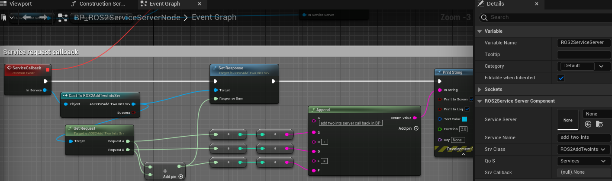

=============================
Service Server Example
=============================

Please follow the instructions in  :ref:`setup_and_run_ue_project` to setup the UE project 
and open  `ROS2ServiceExample.umap <https://github.com/rapyuta-robotics/turtlebot3-UE/blob/devel/Content/Maps/ROS2TopicExamples.umap>`_.

-----------------------------
C++ Service Server
-----------------------------

^^^^^^^^^^^^^^^^^^
Code
^^^^^^^^^^^^^^^^^^

.. code-block:: C++

    //ROS2ServiceServerNode.h

    UCLASS()
    class TURTLEBOT3_API AROS2ServiceServerNode : public AActor
    {
        GENERATED_BODY()

    public:
        AROS2ServiceServerNode();

        virtual void BeginPlay() override;

        UPROPERTY(EditAnywhere, BlueprintReadWrite)
        FString ServiceName = TEXT("add_two_ints");

        UPROPERTY(EditAnywhere, BlueprintReadWrite)
        UROS2NodeComponent* Node = nullptr;

        /**
        * @brief Service callback function
        *
        * @param Service
        */
        UFUNCTION()
        void SrvCallback(UROS2GenericSrv* InService);
    };

.. code-block:: C++

    //AROS2ServiceServerNode.cpp

    AROS2ServiceServerNode::AROS2ServiceServerNode()
    {
        Node = CreateDefaultSubobject<UROS2NodeComponent>(TEXT("ROS2NodeComponent"));

        // these parameters can be change from BP
        Node->Name = TEXT("service_server_node");
        Node->Namespace = TEXT("cpp");
    }

    void AROS2ServiceServerNode::BeginPlay()
    {
        Super::BeginPlay();
        Node->Init();

        ROS2_CREATE_SERVICE_SERVER(Node, this, ServiceName, UROS2AddTwoIntsSrv::StaticClass(), &AROS2ServiceServerNode::SrvCallback);
    }

    void AROS2ServiceServerNode::SrvCallback(UROS2GenericSrv* InService)
    {
        UROS2AddTwoIntsSrv* AddTwoIntsService = Cast<UROS2AddTwoIntsSrv>(InService);

        FROSAddTwoIntsReq req;
        AddTwoIntsService->GetRequest(req);

        // Add two ints.
        FROSAddTwoIntsRes res;
        res.Sum = req.A + req.B;

        // Set response.
        AddTwoIntsService->SetResponse(res);

        // Log request and response
        UE_LOG_WITH_INFO_NAMED(
            LogTurtlebot3, Log, TEXT("[%s][C++][receive request] %d + %d = %d"), *ServiceName, req.A, req.B, res.Sum);
    }

^^^^^^^^^^^^^^^^^^
Code explanations
^^^^^^^^^^^^^^^^^^

On an AROS2ServiceServerNode Actor, similar to the AROS2PublisherNode, 
NodeComponent is created and initialized in the constructor but ROS2 Node is not created here.
Please check :ref:`publisher_examin_code` for the reason.

.. code-block:: C++

    AROS2ServiceServerNode::AROS2ServiceServerNode()
    {
        Node = CreateDefaultSubobject<UROS2NodeComponent>(TEXT("ROS2NodeComponent"));

        // these parameters can be change from BP
        Node->Name = TEXT("service_server_node");
        Node->Namespace = TEXT("cpp");
    }

When the simulation starts, BeginPlay is called. 
In BeginPlay, firstly create and initialize the ROS2 Node by calling 
`UROS2NodeComponent::Init  <../doxygen_generated/html/d7/d68/class_u_r_o_s2_node_component.html#ab9b7b990c4ca38eb60acf8e0a53c3e52>`_
.

.. code-block:: C++

    void AROS2ServiceServerNode::BeginPlay()
    {
        Super::BeginPlay();
        Node->Init();

You can create a service server by using the 
`ROS2_CREATE_SERVICE_SERVER <../doxygen_generated/html/d1/d79/_r_o_s2_node_component_8h.html#a02e1393eb5718c2b10fe60f4498f738b>`_ 
macro, which creates a service server and adds it to the node. 
When the node receives a service request, AROS2ServiceServerNode::SrvCallback is called.

.. code-block:: C++

    ROS2_CREATE_SERVICE_SERVER(Node, this, ServiceName, UROS2AddTwoIntsSrv::StaticClass(), &AROS2ServiceServerNode::SrvCallback);

The SrvCallback method adds two integers and sets the result to the response. 

To retrieve the request, you need to create a request structure (FROSAddTwoIntsReq) 
for the corresponding service (UROS2AddTwoIntsSrv) and retrieve the request by calling GetRequest().

To set the response, you need to create a response structure (FROSAddTwoIntsResp) 
for the corresponding service (UROS2AddTwoIntsSrv) and set the response to the structure. 
Then, call SetResponse() to set the structure to the response.

Finally, log the request and the response.

.. code-block:: C++

    void AROS2ServiceServerNode::SrvCallback(UROS2GenericSrv* InService)
    {
        UROS2AddTwoIntsSrv* AddTwoIntsService = Cast<UROS2AddTwoIntsSrv>(InService);

        FROSAddTwoIntsReq req;
        AddTwoIntsService->GetRequest(req);

        // Add two ints.
        FROSAddTwoIntsRes res;
        res.Sum = req.A + req.B;

        // Set response.
        AddTwoIntsService->SetResponse(res);

        // Log request and response
        UE_LOG_WITH_INFO_NAMED(
            LogTurtlebot3, Log, TEXT("[%s][C++][receive request] %d + %d = %d"), *ServiceName, req.A, req.B, res.Sum);
    }

The implementation of ROS2_CREATE_SERVICE_SERVER is as follows. 
It uses Unreal Engine's dynamic delegate to call the bound function 
when the node receives the message. 
You can find more information about Unreal Engine's dynamic delegate
`here <https://docs.unrealengine.com/5.1/en-US/dynamic-delegates-in-unreal-engine/>`_.

.. code-block:: C++

    DECLARE_DYNAMIC_DELEGATE_OneParam(FServiceCallback, UROS2GenericSrv*, InService /*Service*/);

    #define ROS2_CREATE_SERVICE_SERVER(InROS2Node, InUserObject, InServiceName, InSrvClass, InResponseCallback) \
        if (ensure(IsValid(InROS2Node)))                                                                        \
        {                                                                                                       \
            FServiceCallback res;                                                                               \
            res.BindDynamic(InUserObject, InResponseCallback);                                                  \
            InROS2Node->CreateServiceServer(InServiceName, InSrvClass, res);                                    \
        }

-----------------------------
BP Service Server
-----------------------------

Blueprint implementation of a service server is very similar to a C++ implementation. 
Blueprints allow you to set logic/processes, parameters, and other details from the editor.

You can add component such as UROS2Publisher from `Components` panel in the editor(left side in the fig below)
and set each component parameters in `Details` panel in the editor(right side in the fig below).

The main difference from the C++ implementation is that it uses 
`UROS2ServiceServerComponent <../doxygen_generated/html/d1/db9/class_u_r_o_s2_service_server_component.html>`_
instead of UROS2ServiceServer. 
As UROS2ServiceServerComponent is a child class of 
`UActorComponent <https://docs.unrealengine.com/5.1/en-US/API/Runtime/Engine/Components/UActorComponent/>`_
and has UROS2ServiceServer as a member variable, you can easily add it to the Actor and set parameters from the editor.

The Service server component is attached to an Actor, which is displayed in the `Components` panel on the left.

Initialize the ROS2 Node using the BeginPlay event. 
You can set the ROSNode parameters, such as Name and Namespace, 
from the `Details` panel on the right.

Compared to C++, which uses ROS2_CREATE_SUBSCRIBER, 
in Blueprint, the Subscriber is already generated as a Component before BeginPlay. 
Therefore, we use 
`UROS2NodeComponent::AddServiceServer <../doxygen_generated/html/d7/d68/class_u_r_o_s2_node_component.html#a88c4ddd3037e78b68f62c142015ea91e>`_
to initialize the UROS2ServiceServer and 
`UROS2ServiceServer::SetDelegates <../doxygen_generated/html/d8/d6e/class_u_r_o_s2_service_server.html#a3071892b4f131d18e9f5010077cad485>`_ 
to bind callback method instead. 
The ROS2_CREATE_SERVICE_SERVER macro in C++ internally calls CreateServiceServer which calls AddServiceServer and SetDelegates.

Callback function is bound to a custom event, indicated by the red node on the left. 
This callback function is called when the node receives a request and send response.

