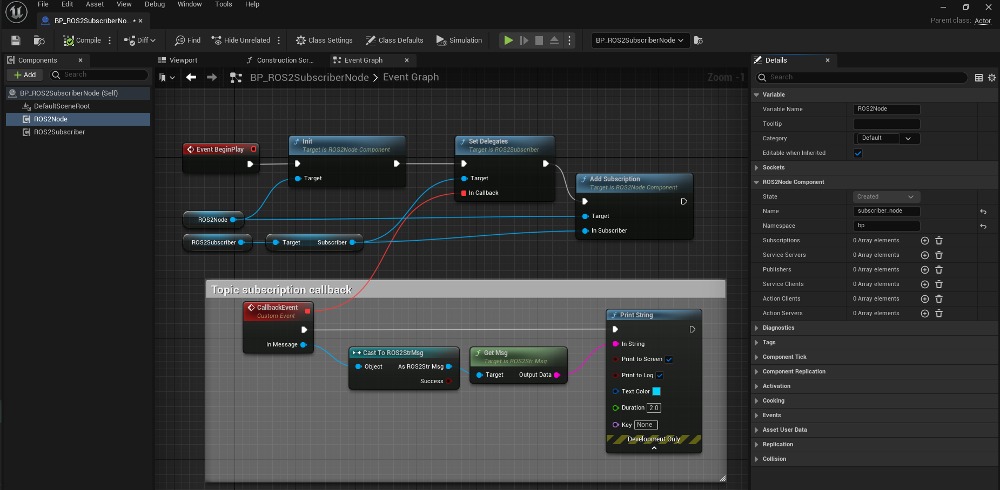
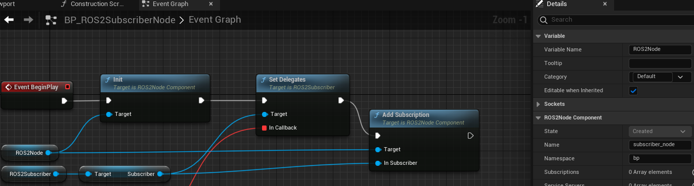
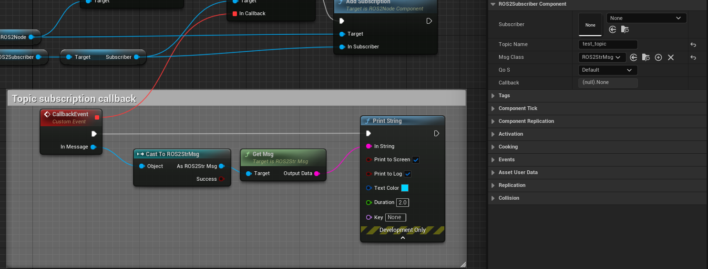

=============================
Subscriber Example
=============================

Please follow the instructions in  :ref:`setup_and_run_ue_project` to setup the UE project 
and open  `ROS2TopicExample.umap <https://github.com/rapyuta-robotics/turtlebot3-UE/blob/devel/Content/Maps/ROS2TopicExamples.umap>`_.

-----------------------------
C++ Subscriber
-----------------------------

^^^^^^^^^^^^^^^^^^
Code
^^^^^^^^^^^^^^^^^^

.. code-block:: C++

    //ROS2SubscriberNode.h

    UCLASS()
    class TURTLEBOT3_API AROS2SubscriberNode : public AActor
    {
        GENERATED_BODY()

    public:
        AROS2SubscriberNode();

        virtual void BeginPlay() override;

        UFUNCTION()
        void MsgCallback(const UROS2GenericMsg* InMsg);

        UPROPERTY(EditAnywhere, BlueprintReadWrite)
        UROS2NodeComponent* Node = nullptr;

        UPROPERTY(EditAnywhere, BlueprintReadWrite)
        FString TopicName = TEXT("test_topic");
    };

.. code-block:: C++

    //ROS2SubscriberNode.cpp

    AROS2SubscriberNode::AROS2SubscriberNode()
    {
        Node = CreateDefaultSubobject<UROS2NodeComponent>(TEXT("ROS2NodeComponent"));

        // these parameters can be change from BP
        Node->Name = TEXT("subscriber_node");
        Node->Namespace = TEXT("cpp");
    }

    void AROS2SubscriberNode::BeginPlay()
    {
        Super::BeginPlay();
        Node->Init();

        ROS2_CREATE_SUBSCRIBER(Node, this, TopicName, UROS2StrMsg::StaticClass(), &AROS2SubscriberNode::MsgCallback);
    }

    void AROS2SubscriberNode::MsgCallback(const UROS2GenericMsg* InMsg)
    {
        const UROS2StrMsg* stringMsg = Cast<UROS2StrMsg>(InMsg);
        if (stringMsg)
        {
            FROSStr msg;
            stringMsg->GetMsg(msg);
            UE_LOG_WITH_INFO_NAMED(LogTurtlebot3, Log, TEXT("%s"), *msg.Data);
        }
    }

^^^^^^^^^^^^^^^^^^
Code explanations
^^^^^^^^^^^^^^^^^^

On an AROS2SubscriberNode Actor, similar to the AROS2PublisherNode, 
NodeComponent is created and initialized in the constructor but ROS2 Node is not created here.
Please check :ref:`publisher_examin_code` for the reason.

.. code-block:: C++

    AROS2SubscriberNode::AROS2SubscriberNode()
    {
        Node = CreateDefaultSubobject<UROS2NodeComponent>(TEXT("ROS2NodeComponent"));

        // these parameters can be change from BP
        Node->Name = TEXT("subscriber_node");
        Node->Namespace = TEXT("cpp");
    }

When the simulation starts, BeginPlay is called. 
In BeginPlay, firstly create and initialize the ROS2 Node by calling 
`UROS2NodeComponent::Init  <../doxygen_generated/html/d7/d68/class_u_r_o_s2_node_component.html#ab9b7b990c4ca38eb60acf8e0a53c3e52>`_
.

.. code-block:: C++

    void AROS2SubscriberNode::BeginPlay()
    {
        Super::BeginPlay();
        Node->Init();

You can create a subscriber by using the 
`ROS2_CREATE_SUBSCRIBER <doxygen_generated/html/d1/d79/_r_o_s2_node_component_8h.html#a5631b2970800c11192fb385728a5169f>`_
macro, which creates a subscriber and adds it to the node. 
When the node receives a message, AROS2SubscriberNode::MsgCallback is called.

.. code-block:: C++

    ROS2_CREATE_SUBSCRIBER(Node, this, TopicName, UROS2StrMsg::StaticClass(), &AROS2SubscriberNode::MsgCallback);

To retrieve the message, you need to create a message structure (FROSStr) 
for the corresponding message (UROS2StrMsg) and retrieve the message by calling GetMsg().

MsgCallback method simply prints the received message in this example.

.. code-block:: C++

    void AROS2SubscriberNode::MsgCallback(const UROS2GenericMsg* InMsg)
    {
        const UROS2StrMsg* stringMsg = Cast<UROS2StrMsg>(InMsg);
        if (stringMsg)
        {
            FROSStr msg;
            stringMsg->GetMsg(msg);
            UE_LOG_WITH_INFO_NAMED(LogTurtlebot3, Log, TEXT("%s"), *msg.Data);
        }
    }

The implementation of ROS2_CREATE_SUBSCRIBER is as follows. 
It uses Unreal Engine's dynamic delegate to call the bound function 
when the node receives the message. 
You can find more information about Unreal Engine's dynamic delegate
`here <https://docs.unrealengine.com/5.1/en-US/dynamic-delegates-in-unreal-engine/>`_.

.. code-block:: C++

    DECLARE_DYNAMIC_DELEGATE_OneParam(FSubscriptionCallback, const UROS2GenericMsg*, InMessage);

    #define ROS2_CREATE_SUBSCRIBER(InROS2Node, InUserObject, InTopicName, InMsgClass, InCallback) \
        if (ensure(IsValid(InROS2Node)))                                                          \
        {                                                                                         \
            FSubscriptionCallback cb;                                                             \
            cb.BindDynamic(InUserObject, InCallback);                                             \
            InROS2Node->CreateSubscriber(InTopicName, InMsgClass, cb);                            \
        }

-----------------------------
BP Subscriber
-----------------------------

Blueprint implementation of a subscriber is very similar to a C++ implementation. 
Blueprints allow you to set logic/processes, parameters, and other details from the editor.

You can add component such as UROS2Publisher from `Components` panel in the editor(left side in the fig below)
and set each component parameters in `Details` panel in the editor (right side in the fig below).

The main difference from the C++ implementation is that it uses 
`UROS2SubscriberComponent <../doxygen_generated/html/d5/d73/class_u_r_o_s2_subscriber_component.html>`_
instead of UROS2Subscriber. 
As UROS2SubscriberComponent is a child class of 
`UActorComponent <https://docs.unrealengine.com/5.1/en-US/API/Runtime/Engine/Components/UActorComponent/>`_
and has UROS2Subscriber as a member variable, you can easily add it to the Actor and set parameters from the editor.

The Subscriber component is attached to an Actor, which is displayed in the `Components` panel on the left.

Initialize the ROS2 Node using the BeginPlay event. 
You can set the ROSNode parameters, such as Name and Namespace, 
from the `Details` panel on the right.

Compared to C++, which uses ROS2_CREATE_SUBSCRIBER, 
in Blueprint, the Subscriber is already generated as a Component before BeginPlay. 
Therefore, we use 
`UROS2NodeComponent::AddSubscription <../doxygen_generated/html/d7/d68/class_u_r_o_s2_node_component.html#a107bc4e732b592facd873ae0a37efe66>`_
to initialize the UROS2Subscriber and 
`UROS2Subscriber::SetDelegates <../doxygen_generated/html/de/d83/class_u_r_o_s2_subscriber.html#a1733472ccb6983bd0821d661419b379c>`_ 
to bind callback method instead. 
The ROS2_CREATE_SUBSCRIBER macro in C++ internally calls CreateSubscriber which calls AddSubscriber and SetDelegates.

Callback function is bound to a custom event, indicated by the red node in the center. 
This callback function is called when the node receives a message.

