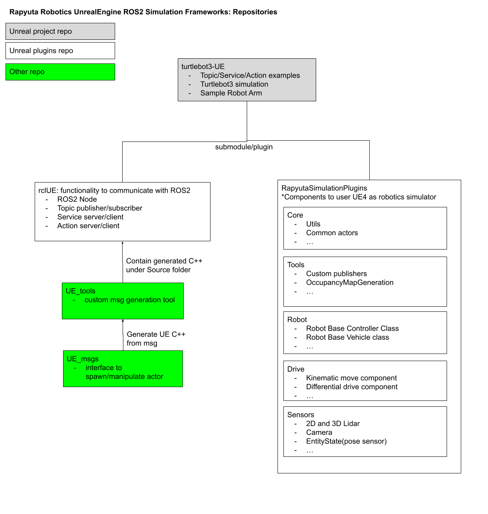

Overview of a group of **rclUE** software
=====================================

Features
--------

.. image:: images/features.png

Repositories
------------

Above figure shows overview of related repositories. Please reference this structure when you create your own ROS2 UE4 simulations.

`turtlebot3-UE <https://github.com/rapyuta-robotics/turtlebot3-UE>`_ 
^^^^^^^^^^^^^^^^^^^^^^^^^^^^^^^^^^^^^^^^^^^^^^^^^^^^^^^^^^^^^^^^^^^^^
Example repository of ROS2 UE4 simulation.

rclUE(this repository)
^^^^^^^^^^^^^^^^^^^^^^^^^^
ROS2 integration features such as creating ROS2 Node, publisher/subscriber and etc.

`RapyutaSimulationPlugins <https://rapyutasimulationplugins.readthedocs.io/en/devel/index.html>`_
^^^^^^^^^^^^^^^^^^^^^^^^^^^^^^^^^^^^^^^^^^^^^^^^^^^^^^^^^^^^^^^^^^^^^^^^^^^^^^^^^^^^^^^^^^^^^^^^^^^^^^^^^^^^^^^^^^^^^^^^^^^^^^^^^^^^^^^^^^
Provides feature to create ROS2 controllable actor, e.g. robot and sensors.
Most of the features in top figure are provided by this repository.
Pleasae check `overview of RapyutaSimulationPlugins <https://rapyutasimulationplugins.readthedocs.io/en/devel/overview.html>`_ 

`UE_tools <https://github.com/rapyuta-robotics/UE_tools>`_
^^^^^^^^^^^^^^^^^^^^^^^^^^^^^^^^^^^^^^^^^^^^^^^^^^^^^^^^^^^^^^^^^^^^^^^^^^^^^^
Provides non UE4 plugin tools such as custom msg generation for UE4.
Please follow README to add new msgs to rclUE.

\* todo: support adding msg to other place than rclUE.

`UE_msgs <https://github.com/rapyuta-robotics/UE_msgs>`_
^^^^^^^^^^^^^^^^^^^^^^^^^^^^^^^^^^^^^^^^^^^^^^^^^^^^^^^^^^^^^^^^^^^^^^^^^^^^^^
Includes ROS2 msg/srv/action files. Please use `UE_tools <https://github.com/rapyuta-robotics/UE_tools>`_ 
to generate necessary C++ files for UE4 plugins. 
